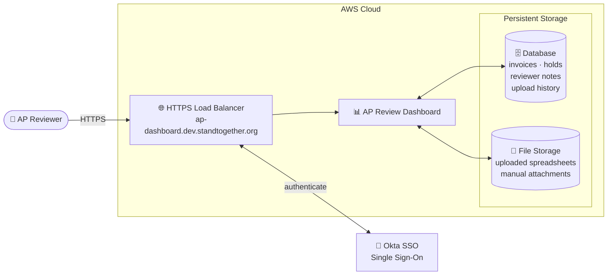

# Architecture

High-level architecture of the AP Review Dashboard, suitable for sharing
with non-technical audiences.

## How it works

- **Reviewers sign in with their existing Okta account** — no separate
  password to manage; access is controlled by the Okta team.
- **All traffic is encrypted** end-to-end via HTTPS with a real certificate.
- **The AWS Load Balancer is the gatekeeper** — every request must pass
  Okta authentication before reaching the application.
- **Two kinds of data are persisted**:
  - **Database** — invoices, hold list, reviewer notes, and a full history
    of every spreadsheet uploaded, so prior days can be reviewed at any time.
  - **File storage** — the original spreadsheets and any manual attachments
    reviewers add to invoices.
- **Reviewer notes and attachments survive every new upload**, because they
  are keyed to entity + bill number rather than to a specific upload.

